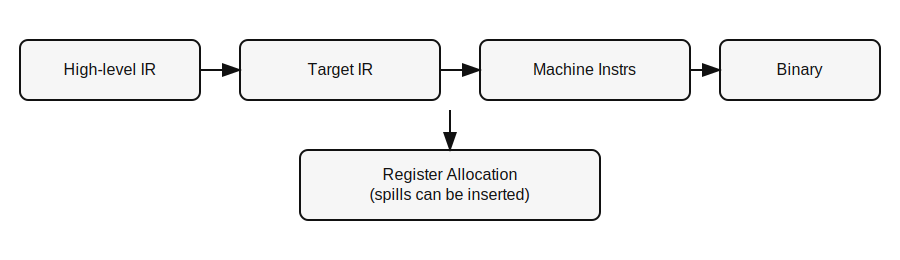

# Why this fuzzer exists: the LLVM AMDGPU backend is a stochastic dumpster fire

If you write HIP code for AMD GPUs, you already know the reality: **LLVM’s
AMDGPU backend regularly miscompiles high‑register‑pressure kernels**. And unfortunately, in HPC apps, those kernels are the norm. When register pressure spikes, spill
behavior becomes a correctness and stability risk — and LLVM’s pipeline
turns those into a game of whack‑a‑mole, fixed in one point release and new miscompiles surfacing in the next.

This post makes the case, with concrete examples, that LLVM’s current
spill architecture is too fragile for the needs of HPC users. If AMD cares
about HIP credibility in HPC, the alternative ACO compiler deserves serious investment.

## GPU Compilers 101

GPUs have a small number of very fast registers. HIP kernels can easily
create more live values than fit. The compiler’s **register allocator
(RA)** tries to keep register usage low so occupancy (the number of
waves that can run at once; a “wave” is a group of lanes that execute in lockstep) stays high. When that isn’t possible, RA
must spill: it chooses values to store to memory and later reload.
The key is not just performance — it is **correctly saving and restoring
state** so the kernel computes the same result as if it never had to temporarily store some values in memory.

Spills are normal — but spill **bugs** are not. The cost of a spill bug
is brutal: non‑deterministic failures, silent numerical corruption, and
weeks of debugging for something that only reproduces on device with a particular version of your kernel and a particular version of the GPU compiler.

## How codegen works (and why RA is heuristic)

At a high level, compilers lower your code in stages: high‑level IR
(intermediate representation) is
optimized, then lowered to a target‑specific IR, then finally to machine
instructions. Each stage throws away some high‑level structure and
replaces it with details needed by the hardware. Register allocation
happens late in this pipeline because it must account for the final
instruction set and calling conventions (the rules for how functions
pass arguments and return values).

In theory, register allocation can be modeled as a graph‑coloring
problem: each live range (the span where a value is live) is a node, and
edges mean two values can’t share a register. Graph coloring is NP‑hard
in the general case, and GPU kernels often have thousands of live
ranges. In practice, compilers use
heuristics — fast approximations that work well on average but can
produce corner cases when combined with complex machine constraints.

## SSA vs machine‑level: the key difference

- **SSA (Static Single Assignment):** each temp is assigned once.
  Data flow is explicit and easier to reason about.
- **Machine‑level (non‑SSA):** values are overwritten, physical registers
  and calling conventions matter, and more bookkeeping is required.

Spilling on SSA values is *simpler*. Spilling late on machine code is
*fragile*, because it must preserve a long list of low‑level invariants.

**Why SSA is more robust:** In SSA, every value has a single definition,
so data flow is explicit and easier to verify. That makes it harder to
accidentally overwrite a value or reuse the wrong register at the wrong
time. Spill insertion can follow those explicit use/def chains, which
reduces ambiguity and makes correctness checks more reliable. In a
non‑SSA, machine‑level pipeline, the same logical value may be rewritten
several times, and the compiler must reconstruct intent from liveness
analysis and implicit operands. That extra reconstruction is where many
edge cases creep in.

## Extra background: blocks, liveness, prolog/epilog, and masks

If you’re not a compiler engineer, here’s the minimum context you need.

- **Straight‑line sequence:** a run of instructions with no branches in
  or out. You enter it once, execute each instruction in order, and then
  leave at the end. There are no mid‑block jumps.
- **Basic block:** a straight‑line sequence with a single entry and a
  single exit. Compilers reason about control flow as a graph of these
  blocks.
- **Liveness:** a value is *live* at a point if it might be used later.
  Spill code must preserve liveness or you get use‑before‑define bugs.
- **Prolog/epilog:** LLVM inserts a *prolog* at function entry and an
  *epilog* at function exit to save/restore registers and set up stack
  state. Spill code often lands here, so prolog/epilog logic must agree
  with the allocator and with later passes.
- **Predicated/masked execution:** AMD GPUs can execute instructions on a
  subset of lanes using an execution mask (EXEC). That means a “write”
  might only update some lanes. Whole‑wave (WWM) operations, helper
  lanes, and EXEC manipulation make correctness *much* harder because
  spills can accidentally clobber lanes that were supposed to be inactive.
- **WQM/exact execution:** WQM (whole‑quad mode) expands the EXEC mask to
  include helper lanes for correct derivatives; exact execution does
  not. Switching between them is a common source of correctness hazards.
- **Implicit operands:** Some machine instructions read or write registers
  without listing them explicitly in the operand list. The compiler tracks
  these as *implicit operands* to preserve liveness and ordering. If an
  implicit operand is missing or wrong, the compiler can “forget” that a
  register is used or clobbered, which leads to subtle spill bugs.
- **Invariant:** a rule that must always hold for the compiler’s internal
  reasoning to stay correct (for example, “every reload is dominated by a
  store” or “a live value must not be overwritten”). When invariants are
  broken, miscompiles and hard‑to‑debug crashes follow.
- **Dominance:** in a control‑flow graph, block A *dominates* block B if
  every path to B goes through A. For spills, it means a reload must be
  dominated by a store — otherwise there exists a path that reloads a
  value that was never saved.
- **Control‑flow graph (CFG):** the directed graph of basic blocks that
  represents all possible paths through the program.
- **Register classes (AMD‑specific):** AMD GPUs have different kinds of
  registers. **SGPRs** are scalar (one value for the whole wave) and
  **VGPRs** are vector (one value per lane). There are also special
  **AGPRs** (matrix/accumulator registers) and **linear VGPRs** used for
  whole‑wave or spill bookkeeping. The compiler must keep these classes
  separate and obey hardware rules about how they can be read, written,
  and aliased. Many spill bugs are really “wrong class” bugs — a value
  ends up in the wrong kind of register or the wrong class gets reused.
- **Spills often change class before memory:** On AMD GPUs, spilling an
  SGPR might first move the value into a VGPR (often a linear VGPR lane)
  and only then write to scratch memory. Likewise, AGPR spills can route
  through VGPRs. This extra step means spills are not just “store to
  memory” — they are *class conversions* plus a store. That creates more
  room for bugs when class boundaries and liveness are not handled
  perfectly.
- **Live‑in:** a value that is already live at the entry of a basic
  block. The compiler must model these explicitly so uses are not
  treated as uninitialized.
- **Callee‑saved register (CSR):** a register the callee must preserve
  across a function call. Spill code often saves/restores these in the
  prolog/epilog.
- **Frame index elimination:** a late pass that replaces abstract stack
  slot references with concrete offsets or registers.\n- **Register
  scavenging:** the process of finding a temporary register when no free
  register appears available.
- **MIR and DBG_VALUE_LIST:** LLVM’s machine‑level IR (MIR) and its debug
  value records; these must be updated when spills change where values
  live.

**ACO vs LLVM on masked execution (high level):** ACO explicitly models
WQM/WWM/exact execution with dedicated passes (e.g., `aco_insert_exec_mask`)
and uses linear VGPR classes to keep whole‑wave values separate. LLVM
manipulates EXEC at the machine‑instruction level and uses a set of late
passes (e.g., WWM copies and pre‑allocation) to preserve mask semantics
after RA. Both approaches work, but LLVM’s later, machine‑level approach
creates more opportunities for spills and register reuse to interfere
with mask correctness.

This is why spills are not just “stores and loads.” They are stores and
loads in a control‑flow graph, under liveness constraints, inside a
prolog/epilog regime, and with masked execution semantics layered on top.

## Why two compilers exist

LLVM and ACO exist because they were built for different constraints.
LLVM is a general‑purpose compiler infrastructure used across many CPU
and GPU targets; AMDGPU codegen lives inside that ecosystem and inherits
its machine‑level pipeline. ACO was written by Valve for graphics
shaders inside Mesa, as a GPU‑first compiler with an SSA IR.

For additional historical context, Daniel Schürmann’s 2019 mesa‑dev RFC
notes that ACO’s SSA design enables more precise register pressure
control and SSA‑level RA: it “allows to precisely pre‑calculate the
register demand of a shader” and delivers “more precise control over
register pressure which can ultimately lead to more efficient binaries.”
(See the full thread:
https://lists.freedesktop.org/archives/mesa-dev/2019-July/221006.html.
See also the ACO XDC 2019 slide deck:
https://lpc.events/event/5/contributions/334/attachments/431/683/ACO_XDC2019.pdf.)

## Two pipelines, two risk profiles

**LLVM AMDGPU (simplified):**

- Lowers to machine instructions.
- Runs machine‑level RA and inserts spills.
- Lowers spills during frame/prolog/epilog passes.
- Many later passes must still honor those spill decisions.

**ACO (simplified):**

- Runs a dedicated SSA‑based spill pass **before** RA.
- Inserts `p_spill` / `p_reload` at SSA level.
- RA then maps the SSA program onto physical registers.

Same target, very different spill risk surface area.

## The problem

> LLVM’s AMDGPU spill path is too brittle to reliably compile high-register-pressure kernels that are the norm in HPC code. It
> inserts and rewrites spills late, at machine level, and that design
> *creates* edge cases. ACO spills early, in SSA, which removes whole
> categories of failure.

This shows up regularly in the LLVM commit history.

## Evidence: spill fixes in the LLVM AMDGPU backend

These are not esoteric corner tweaks. They are fundamental correctness
repairs that keep happening because the design is fragile.

## Case study: WWM vs per-thread VGPR clobbering

**The bug:** LLVM's backend has hit a correctness issue where whole-wave
(WWM) operations and regular per-thread VGPR operations get allocated in
the same narrow physical register range. This causes WWM operations to
clobber inactive lanes of per-thread values. The resulting miscompiles
are hard to reproduce and debug, especially under high register pressure.

**The LLVM fix:** LLVM's solution was to split the VGPR allocation
pipeline: allocate WWM registers first, then run a separate allocation
pass for normal VGPRs that excludes those WWM registers. This is an
explicit admission that the machine-level allocator can otherwise reuse
registers in an unsafe way. The fix landed in
`bb64a63fad0a` (“[AMDGPU] Split vgpr regalloc pipeline”), which explicitly
calls out the clobbering of inactive lanes when WWM and regular VGPRs are
allocated together.

**Why ACO should avoid this class of bug (if WWM is correctly tagged):**
ACO encodes whole-wave values as **linear VGPRs** (see the `v*_linear`
register class in `src/amd/compiler/aco_ir.h`). Linear VGPRs are
allocated in a dedicated range at the end of the VGPR file and are kept
separate from normal VGPRs (`alloc_linear_vgpr()` and linear VGPR bounds
handling in `src/amd/compiler/aco_register_allocation.cpp`). In
addition, ACO's live-range logic forces linear VGPR operands to be
`lateKill` when there is a normal VGPR definition, preventing them from
sharing the same physical register in the same instruction
(`src/amd/compiler/aco_live_var_analysis.cpp`).

In other words, the separation is **structural** in ACO's design, not a
late-stage workaround. If WWM values are correctly identified as linear
VGPRs, the allocator never puts them in the same pool as per-thread
VGPRs, so the clobbering scenario described above should not be
possible.

## The whack-a-mole pattern: spill edge cases keep landing

The WWM case is only one example. LLVM’s spill-related history is full of
corner cases that crop up, get fixed, and then are followed by the next
corner case. That is exactly what “whack-a-mole” looks like in a compiler
pipeline that inserts and rewrites spills late.

### 1) Physical register liveness and implicit operands

Machine‑level spill code relies on implicit operands for liveness. It’s
very easy to get this wrong, and LLVM has repeatedly done so.

- **Non‑reserved CSR spilled regs weren’t live‑in** (`d28bb1fd7866`)
- **Implicit‑def on last subreg restore broke liveness** (`4fb7d1953d3f`)
- **AGPR tuple liveness wasn’t preserved** (`bdaa82a7bb14`)

### 2) Prolog/epilog semantics and pass ordering

LLVM’s prolog/epilog heuristics are touchy. Spills that land in the wrong
“prologue bucket” can derail RA or violate invariants (i.e., the allocator
skips over a spill it should have seen).

- **VGPR spills treated as prologue confused RA** (`735a5f67e351`)
- **WWM spill reloads ignored by later RA** (`6636f3261500`)
- **Prolog emission erased instructions too early** (`3027b4a55bf7`)

### 3) Dominance and control‑flow correctness

Spill reloads must be dominated by a store along every path. LLVM needed
explicit checks to stop rewriting spills into invalid code.

- **Dominance checks added for spill rewrites** (`e5d02ddb4b1d`)

### 4) Scavenging and frame‑index elimination

Late frame‑index elimination can require scavenging a spare register. If
none exist, LLVM used to hit assertions.

- **Avoided scavenger failure by skipping forced spills** (`1c3a9a853ce6`)

### 5) Debug/MIR bookkeeping

Even debug handling around spills has broken enough to require fixes.

- **DBG_VALUE_LIST operand indexing fix** (`3659aa8079e0`)

## Why this is bad for HIP HPC users

HPC kernels hit extreme register pressure. That makes spill behavior
critical. When the spill pipeline is fragile:

- Bugs show up only in production with optimizations on.
- Failures are data‑dependent and intermittent.
- Debugging is a nightmare.

HIP developers pay the price. AMD’s platform reputation pays the price.

## Why GPU spill bugs show up more than CPU spill bugs

Spill problems are not unique to GPUs, but AMDGPU hits a perfect storm of
complexity that makes these bugs far more likely to surface in
production.

- **Masked execution:** CPUs are scalar; a write updates the whole value.
  AMD GPUs use an EXEC mask, so a write may update only some lanes. Spill
  code that ignores or mishandles masks can silently corrupt inactive
  lanes.
- **More register classes:** AMDGPU has SGPRs, VGPRs, AGPRs, and linear
  VGPRs. Spills often convert between these classes before hitting
  memory. CPUs have fewer class boundaries and fewer opportunities to get
  liveness wrong during conversion.
- **Extreme register pressure:** HPC kernels often push GPU registers to
  the limit to maximize occupancy. That means spilling is common and
  heavily stressed. CPU workloads usually spill less aggressively.
- **Late pipeline rewriting:** AMDGPU does significant machine‑level
  rewriting after RA (prolog/epilog, WWM handling, EXEC manipulation).
  Each pass is another opportunity to break a spill invariant.

The net effect is that GPU spill bugs are not just more likely; they are
also harder to detect and reproduce than their CPU counterparts.

## Why ACO changes the risk profile

ACO is not a silver bullet, but its spill architecture is simply cleaner:

- Spills are inserted on SSA values, *before* physical register assignment.
- There is less reliance on implicit operands and physical liveness hacks.
- Fewer late passes can invalidate spill invariants.

That does not guarantee zero bugs, but it **does reduce the number of
ways** you can get them.

## What AMD leadership should hear

If AMD wants HIP to be taken seriously for HPC, it needs a compiler story
that does not depend on fragile late‑stage spill lowering. LLVM’s
AMDGPU backend keeps proving that this is a hard problem to stabilize.

ACO is already real, already proven in Mesa, and already handling
SSA‑level spilling in a way that reduces these failure modes. The case
for making ACO a first‑class HIP compiler is not ideological — it’s
operational. It’s about reducing bug surface area and increasing trust.
There is also reporting that ACO can produce faster compute
kernel code than LLVM in some cases (see the Phoronix write‑up:
https://www.phoronix.com/news/RADV-ACO-NN-Win).

## Takeaway

Spills are the most visible pain point for HPC users today, but they are
not the only reason to take ACO seriously. A compiler built around SSA
form tends to simplify data‑flow reasoning, make optimizations more
predictable, and reduce the number of cross‑pass invariants that must
stay aligned late in the pipeline. Those properties matter for
correctness, performance tuning, and long‑term maintainability.

LLVM AMDGPU spilling, as it exists today, is a liability for HPC code. If AMD
wants HIP to succeed long‑term, it should invest in a compiler path with
a cleaner SSA‑centric foundation. ACO is the most credible candidate.

To make that path real for HIP, there are still technical obstacles to
solve: HIP‑specific language features and intrinsics need ACO‑compatible
lowering, kernel ABI and debug info handling must be complete, and the
toolchain needs tight integration for LTO and profiling.

### A concrete path: SPIR‑V (AMDHSA) → NIR → ACO

The cleanest path to get ACO to compile HIP kernels is SPIR‑V (AMDHSA) → NIR → ACO: Clang lowers to SPIR‑V, Mesa’s SPIR‑V frontend
produces NIR, and ACO handles scheduling and register allocation. That
still requires AMD‑specific legalization (features, address spaces, ABI,
exec masks, atomics), but it keeps the integration surface clear and
lets ACO do what it’s good at.

## option to use ACO now: rewrite kernels in OpenCL

If the LLVM path takes 1-2 years, there is a pragmatic alternative today: rewrite the hottest kernels in OpenCL and run them through Mesa's ACO pipeline. This is not a perfect drop-in replacement for HIP, but it can be a targeted escape hatch for the kernels most likely to trigger spill failures.

Concrete toolchain paths:

- **Rusticl + Mesa + ACO (OpenCL runtime path):**
  OpenCL C → SPIR-V (clang) → rusticl (Mesa OpenCL) → NIR → ACO → AMDGPU ISA.
  This is the most direct way to get OpenCL kernels onto ACO today.
- **clspv + Vulkan + RADV + ACO (Vulkan compute path):**
  OpenCL C → SPIR-V (clspv) → Vulkan compute → RADV → NIR → ACO.
  This is not OpenCL, but it can work if you're willing to drive kernels through Vulkan instead of an OpenCL runtime.

If you want a true OpenCL runtime, rusticl is the answer. If you can tolerate a Vulkan compute path, clspv is viable and has a mature SPIR-V backend.

Key tradeoffs and constraints:

- **Feature mismatch:** HIP and OpenCL are not one-to-one. You may need to replace HIP intrinsics, rework pointer/address-space usage, and avoid newer language features.
- **Tooling friction:** The build and runtime toolchain will change. Expect new compiler flags, different debug info, and different profiling workflows.
- **Kernel-only scope:** This is a kernel rewrite, not a full host-side port. Keep the host code in HIP or C++ and swap in OpenCL kernels for the hot paths.
- **Performance risk:** ACO tends to be more stable under high register pressure, but performance is not guaranteed to match HIP+LLVM out of the box. Expect tuning work.
- **Maintenance cost:** You will likely maintain two versions of the same kernel logic until the LLVM path improves.

This is not a long-term answer, but it is a way to get ACO's SSA-based spill behavior today for the most fragile kernels, without waiting on a multi-year compiler rewrite.

## TL;DR

ACO is better designed for AMDGPU codegen because it is **GPU‑first** and
**SSA‑centric**, while LLVM’s AMDGPU backend is a general‑purpose,
machine‑level pipeline that must retrofit AMDGPU‑specific semantics late.
That architectural difference matters in practice:

- **Fewer spill failure modes:** ACO inserts spills at SSA level and keeps
  whole‑wave values in a separate linear VGPR class, which avoids entire
  classes of register‑reuse bugs that LLVM has had to fix after the fact.
- **Cleaner control‑flow reasoning:** ACO models logical and linear CFGs
  explicitly, making divergence and masked execution easier to handle
  without late pass interference.
- **Predictable register pressure control:** SSA‑based RA enables more
  precise register demand estimation, which is critical for occupancy‑
  sensitive kernels.

Most importantly, the clean SSA-based compiler design means that HIP developers 
can stop playing "whack-a-mole" in an endless cycle of writing reproducers for register spill bugs, getting them fixed in the next ROCm point release, and then seeing new corner cases that cause production code to crash on the biggest supercomputer in the world...

Yes, it's been frustrating. I hope AMD execs listen and have the real long-term vision to fix this architecturally.

## alterative path to ACO: fix LLVM

If AMD decides not to push HIP onto ACO, the only viable long-term alternative is to structurally fix LLVM's AMDGPU backend so it prevents the same spill failure modes that ACO avoids by design. That means changing the backend architecture, not adding more late fixes:

- **Make register allocation spill-free:** turn RA into a pure mapping step by banning post-RA spill insertion. If pressure is too high, rerun the SSA spill pass instead of spilling late.
- **Insert all spills in SSA MIR:** add an early SSA-level spill pass that inserts explicit spill/reload ops before regalloc. Keep MIR in SSA until all spill decisions are final.
- **Encode register classes explicitly:** treat whole-wave values as a separate linear VGPR class and enforce non-overlap with per-lane VGPRs.
- **Model EXEC/WQM in SSA:** make mask changes explicit in SSA so spill placement respects masked execution and dominance.
- **Minimize PEI to frame lowering only:** PEI should only lower known frame indices from SSA spills, not invent new spills or late stack objects.

This is effectively an ACO-style compiler path inside LLVM: SSA-first spills, RA as mapping, and explicit modeling of GPU-specific execution semantics. Anything short of this will keep the same late-spill risk surface that has produced years of correctness fixes.
